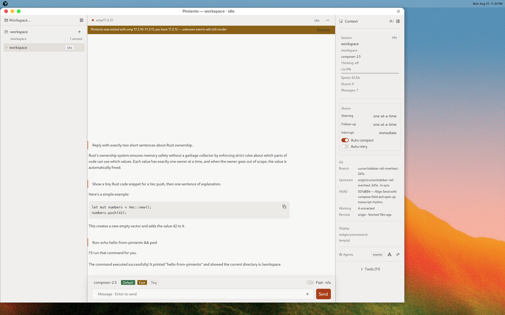
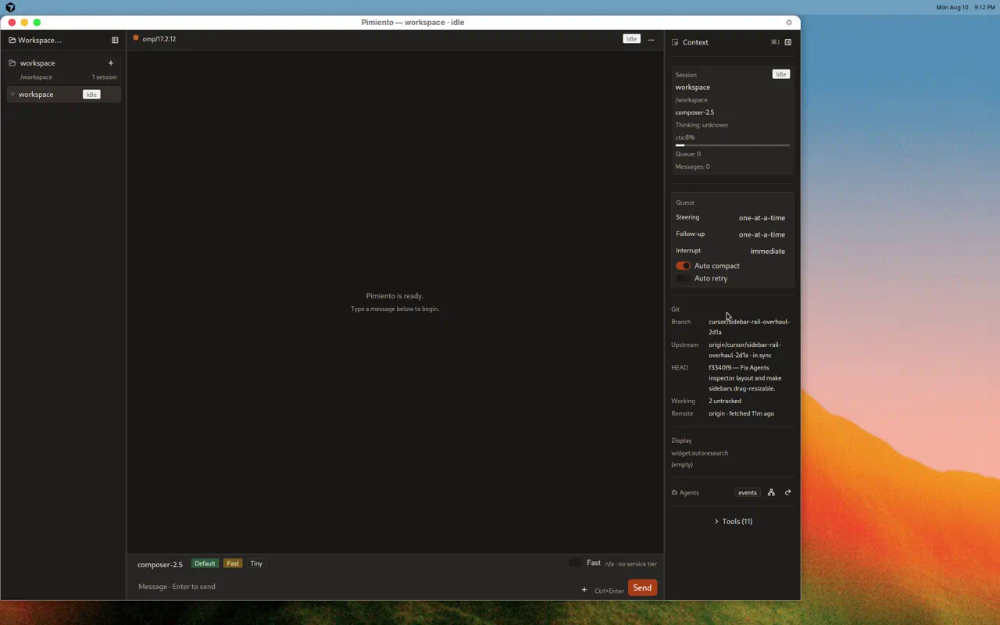
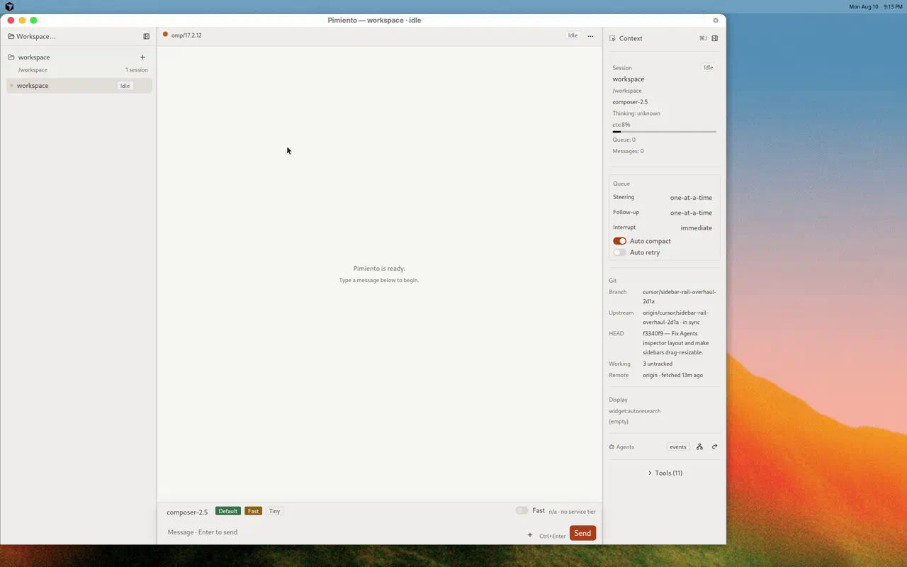

# Pimiento

**A native desktop client for [Oh My Pi](https://omp.sh) (`omp`).**

Pimiento turns your existing `omp` install into a fast, GPUI-powered workspace: streaming transcript, tool cards with full output, dialogs, abort/steer, sessions, and a status strip that stays honest about what the agent is doing.

It does not replace OMP. OMP remains the sole authority over agent and session state — Pimiento is a projection and command surface.

<p align="center">
  
</p>

## Highlights

- **Native** — Rust + GPUI on macOS and Linux (not Electron)
- **Your OMP** — discovers the `omp` on your login-shell `PATH`, inherits auth and config from `~/.omp`
- **Semantic stream** — text deltas, tool cards, thinking, notices, and unknown frames always render
- **Self-host ready** — abort/steer, extension-UI dialogs, resume-by-pointer, crash cards with restart

<p align="center">
  
  &nbsp;
  
</p>

## Requirements

- Rust stable (see `rust-toolchain.toml` / workspace `rust-version`)
- [omp](https://omp.sh) installed and available on your **login-shell** `PATH`
- macOS or Linux

Tested OMP range is documented in-app via the version-gate banner (currently **17.2.10–17.2.11**; newer builds still run with unknown events rendered).

## Quick start

```sh
# Install omp if needed (run this yourself — Pimiento never auto-installs)
curl -fsSL https://omp.sh/install | sh

# Build and launch
./scripts/run_app.sh
```

`scripts/run_app.sh` builds `pimiento-app`, replaces any running debug instance, and launches with auto-connect. Skip the rebuild with `PIMIENTO_SKIP_BUILD=1`. Force a theme for one process without changing stored prefs:

```sh
PIMIENTO_THEME=light ./scripts/run_app.sh
```

### Optional: install a local macOS `.app`

```sh
./scripts/package_macos_app.sh
./scripts/install_macos_app.sh   # → ~/Applications/Pimiento.app
```

See [docs/packaging.md](docs/packaging.md) for Linux tarball packaging. Signing/notarization remains deferred.

## What Pimiento is (and is not)

| Is | Is not |
|----|--------|
| A frontend for your existing `omp` | An OMP installer, updater-by-default, or settings mirror |
| A streaming agent workspace | A full IDE / terminal emulator / browser |
| Disposable UI state (draft, scroll, layout) | Owner of messages, auth, or session truth |

## Architecture

```text
omp-rpc-client  →  pimiento-core  →  pimiento-app
   (wire)            (projection)        (GPUI)
```

Protocol types never import UI types. Unknown wire data always renders. See [docs/architecture.md](docs/architecture.md) and [docs/protocol-notes.md](docs/protocol-notes.md).

## Development

```sh
scripts/gate.sh          # fmt → clippy → nextest → cargo audit → nightly canary
./scripts/dev_loop.sh    # rebuild/restart loop
./scripts/reveal_logs.sh # open local logs
```

Requires [cargo-nextest](https://nexte.st/) and [cargo-audit](https://github.com/RustSec/rustsec/tree/main/cargo-audit). Contribution guide: [CONTRIBUTING.md](CONTRIBUTING.md).

## Security

See [SECURITY.md](SECURITY.md) for the threat model and how to report vulnerabilities privately.

## Code of Conduct

This project follows the [Contributor Covenant](CODE_OF_CONDUCT.md).

## License

Apache-2.0. See [LICENSE](LICENSE). Theme attribution: [docs/third-party-theme-notices.md](docs/third-party-theme-notices.md).

GPUI / `gpui_platform` / `gpui-component` are Apache-2.0. Do not copy source from Zed’s GPL crates (`ui`, `editor`, `terminal_view`, `agent_ui`) — patterns only.
